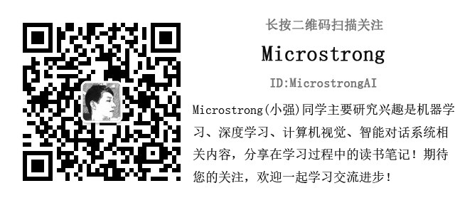

# WeChat-zhihu-csdnblog-code
**WeChat Official Accounts, zhihu and CSDN'blog code**

1. [Regression Tree 回归树](https://mp.weixin.qq.com/s/HWvlxtnvXE9-Z9VNWDGOgg) | [code](./Decision%20Tree/lihang_5.2)
1. [深入理解提升树（Boosting tree）算法](https://mp.weixin.qq.com/s/UepQi5Qezdi27MvbUSyLCA) | [code](./Ensemble%20Learning/Regression_BoostingDecisionTree.py)
1. [深入理解GBDT回归算法](https://mp.weixin.qq.com/s/adMMz8u29OnvqelgZuXWjg) | [手撕GBDT回归算法-code](./Ensemble%20Learning/GBDT_Regression) | [sklearn-code](./Ensemble%20Learning/GBDT_Regression_sklearn)
1. [【完善版】深入理解GBDT二分类算法](https://mp.weixin.qq.com/s/4T6OD2Hr5MzNI0j-mT3e-g) | [手撕GBDT回归算法-code](./Ensemble%20Learning/GBDT_GradientBoostingBinaryClassifier) | [sklearn-code](./Ensemble%20Learning/GBDT_Classification_sklearn/GBDT_Binomial_Classification.py)
1. [深入理解GBDT多分类算法](https://mp.weixin.qq.com/s/-UmOhpktgRaOF7tT2-5nsQ)
1. [深入理解XGBoost](https://mp.weixin.qq.com/s/HDEKnIufbW8xQcOgHaXlZw)
